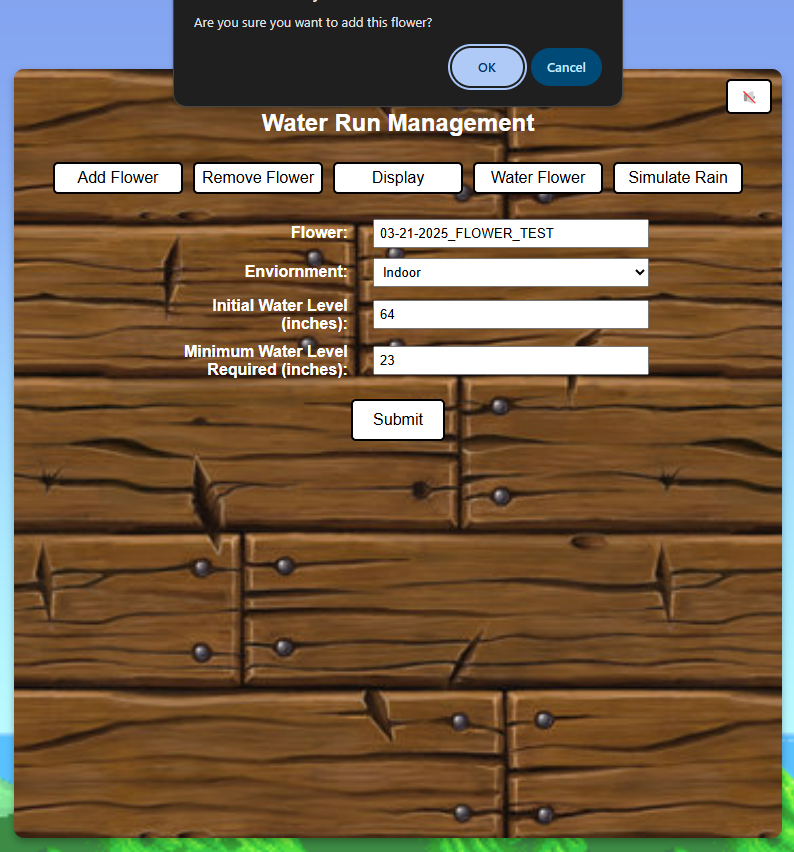
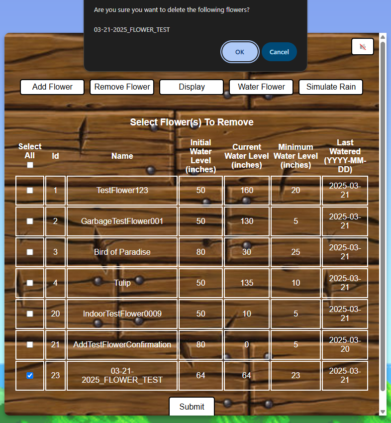
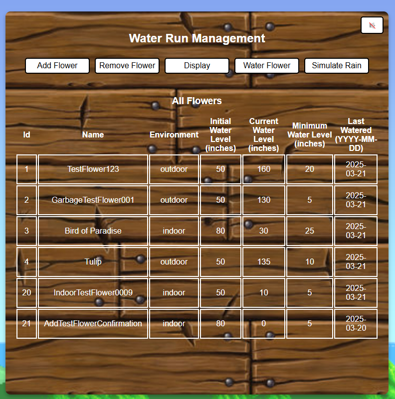
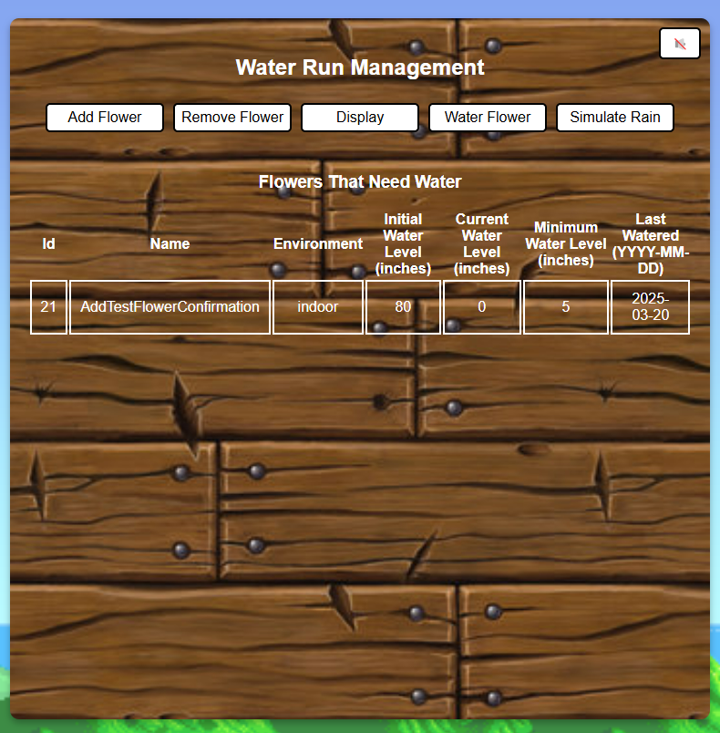
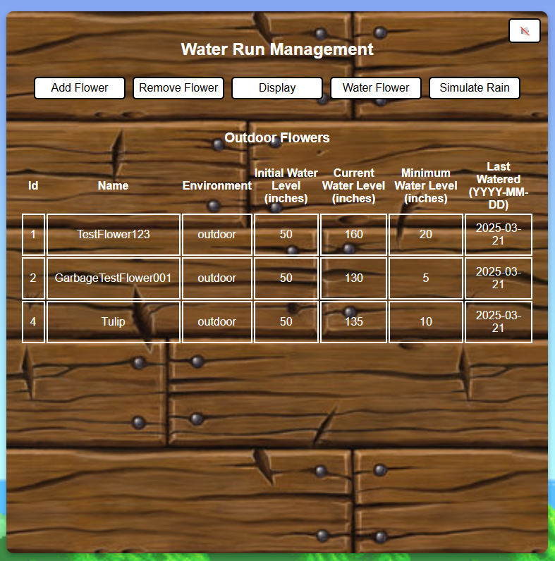
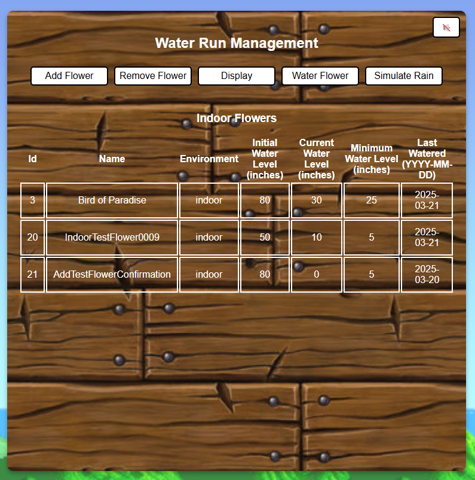
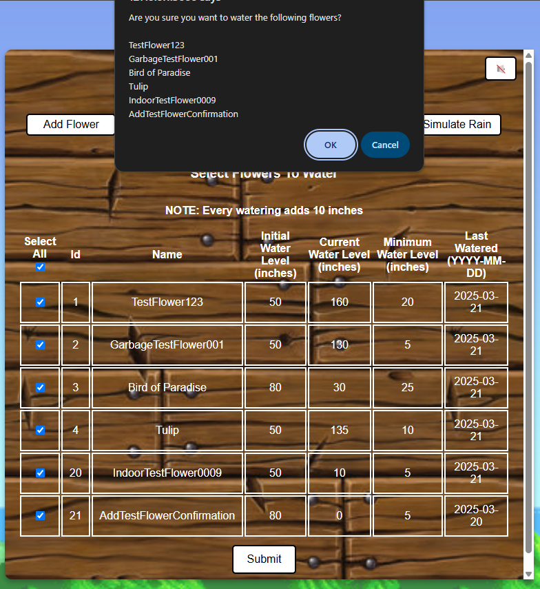
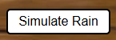

## **COMP 163 - Spring 2025: TEAM 1**
- Parneet Kheira
- Clara Salazar
- David Yang

## **Water Run Management - A flower watering tracking system**

### **Features:**
- Add/Remove/Water all or selected flowers
- See all flowers kept Indoors or Outdoors
- Water levels for flowers automatically decrease by five based on the current date compared to the last watering

### **Technologies:**
- Database: PostgreSQL, AWS RDS
- Front-end: HTML/CSS
- Back-end: Python, Flask

### **How To Run:**
1. If Python isn't installed on your local machine, download it [here](https://www.python.org/downloads/)
2. Once Python is installed, and our project is downloaded on your local machine, open the project with Visual Studio Code (if you don't have VSCode, download it [here](https://code.visualstudio.com/))
3. Once DMS is opened in VSCode, navigate to `project\part1\team-1\PostgreSQL\Web`
4. Install the following Python libraries:
- `pip install flask`
- `pip install psycopg2`
- `pip install dotenv`
5. Within the `team-1` directory, open the `PostgreSQL` folder and move the file, `water_run.env`, outside of the project and onto your local machine
6. Copy the path of where the `water_run.env` is at go into `postgress_crud.py` and paste the path between the quotes of  `load_dotenv(r"")`
7. With the path pasted, type out `python app.py`
8. Navigate to the local host link or in your browser, type in: `127.0.0.1:5000` to access the web app

### Web Pages
1. flowers.html
- Add a new flower
- Set the new flower's environment between indoor or outdoor
- Set the initial water level for the new flower
- Set the minimum water level for the new flower
- **NOTE**: You'll be prompted to confirm the addition of the new flower

2. delete_flower.html
- Delete an existing flower in the database by checking its box
- Check the `Select All` to remove all flowers in the database
- **NOTE**: You'll be prompted to confirm the removal of the selected flower(s)

3. all_flower.html
- Displays all existing flowers and there attributes

4. needs_water.html
- Displays all flowers who's current water level is less than their minimum water level

5. outdoor_flower.html
- Displays all flowers who's environment is `Outdoor`

6. indoor_flower.html
- Displays all flowers who's enviorment is `Indoor`

7. water_flower.html
- Water an existing flower in the database by checking its box
- Check the `Select All` to water all the flowers within the database
- **NOTE**: You'll be prompted to confirm the watering of the selected flower(s), also each watering addes 10 inches of water to the selected flower's current water level
- After watering a selected flower, their `Last Watered` will update to the current date

8. Simulate Rain
- Automatically adds 10 inches of water to the current water level of all flowers whose environment is `Outdoor`
- After simulating rain, the `Last Watered` of all flowers whose environment is `Outdoor` will update to the current date

